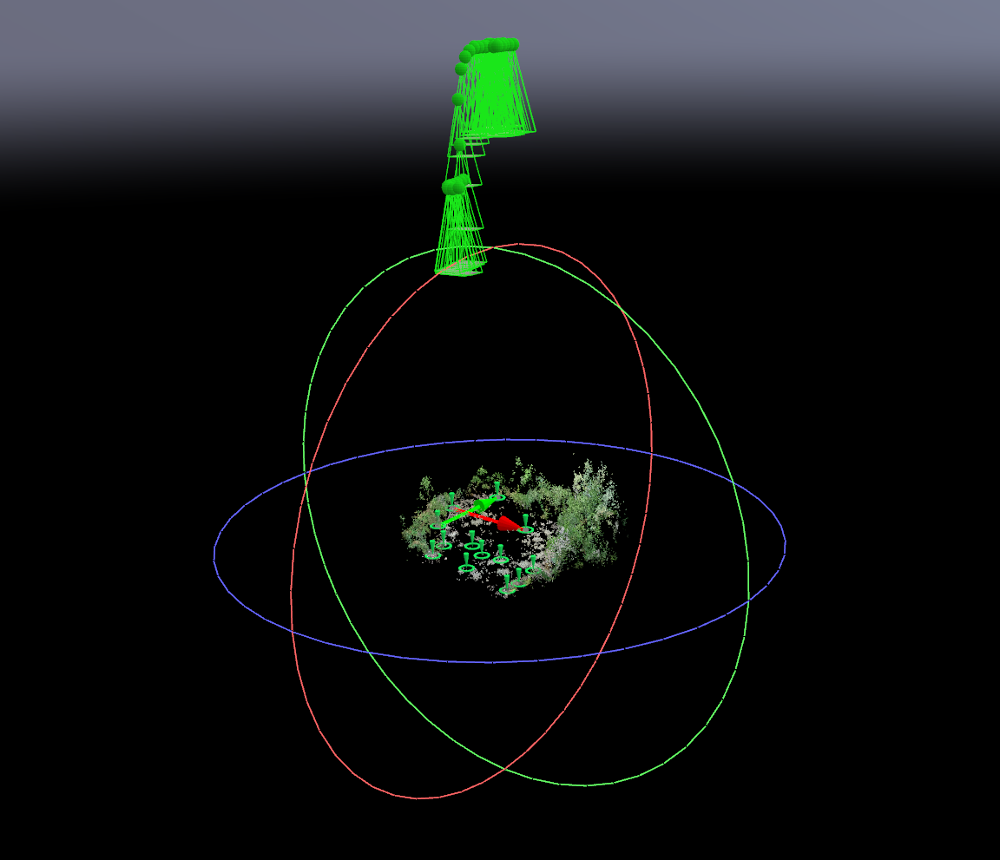
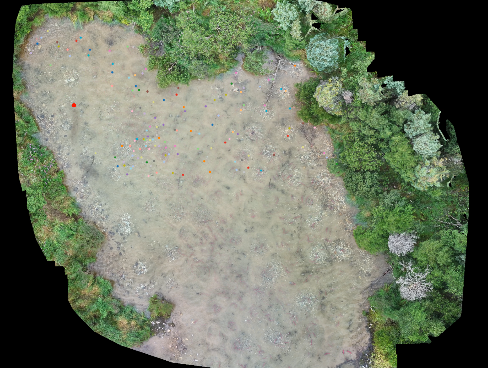

Initial notebooks for detection, tracking, and landscape projection in the context of bears hunting salmon.

Relies on the [koger_detection](https://github.com/benkoger/detection-projects) package. See the corresponding readme for instructions for locally pip installing this package.

All dependencies are specified in the [requirements.txt](https://github.com/benkoger/bear-hunting/blob/main/requirements.txt) file except for torch which should be installed to match your specific machine (i.e. operating system, CPU or GPU etc.) following the instructions here: https://pytorch.org/get-started/locally/ This repo has been tested with torch==2.3.1+cu121 and python3.10
Install all dependencies at once by with ```pip install -r requirements.txt```

The following environmental variables are expected to be specified in a .env file.
- ROOT is the path to main folder for this repo.
- PROJECT_DROPBOX is the path to the dropbox folder for this project.

## Basic workflow
### Detection and tracking within the coordinates of the video
This is done with the notebooks within the detection folder.
- download_dataset.ipynb
  - This downloads annotaions from labelbox and divides the annotations into a train and val set.
- train_model.ipynb
  - Trains an object detection model with a given train.json and val.json
- video_inference.ipynb
  - Runs object detection and tracking on a given video

### Projecting tracks from video coordinates to georeferenced coordinates
This is done with notebooks in the landscape folder
- get_anchor_frames.ipynb
  - Takes a video and extracts appropriate frames to use for constructing a 3D landscape model
- The extracted frames are then passed to Pix4D to actually construct the landscape model.
  - This is a manual step done outside of these notebooks.
- to_landscape.ipynb
  - This takes the outputs from pix4D and the tracks from video_inference.ipynb and projects the individual trajectories into the landscape model.





